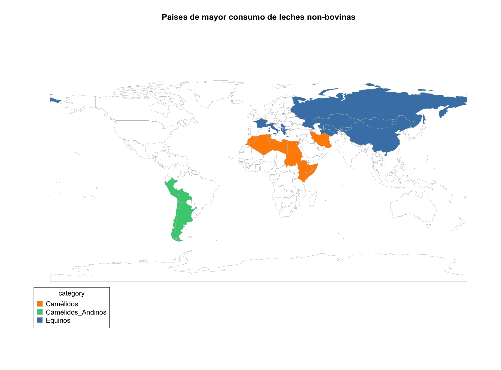

````markdown
# 🌍 Mapa interactivo de especies

Aplicación Shiny en R que permite visualizar en un mapa mundial la distribución de diferentes especies animales asociadas a la producción de leche (camélidos, equinos, etc.).  
El usuario puede agregar países, crear nuevas categorías de especies y descargar el mapa resultante como imagen PNG.

---

## 🚀 Funcionalidad

- Añadir países escribiendo su nombre en inglés (ej. "Mongolia", "France", "Peru").
- Seleccionar una especie existente o **crear una nueva categoría** con color asignado automáticamente.
- Visualizar el mapa mundial con los países coloreados según la especie elegida.
- Descargar el mapa como archivo PNG.
- Reiniciar el mapa y las categorías cuando se desee.

---

## 🧩 Tecnologías utilizadas

- [R](https://www.r-project.org/)
- [Shiny](https://shiny.posit.co/)
- [rworldmap](https://cran.r-project.org/package=rworldmap)
- [countrycode](https://cran.r-project.org/package=countrycode)
- [RColorBrewer](https://cran.r-project.org/package=RColorBrewer)
- [shinythemes](https://cran.r-project.org/package=shinythemes)
- [dplyr](https://cran.r-project.org/package=dplyr)

---

## 📦 Instalación y uso

1. Clona este repositorio:
   ```bash
   git clone https://github.com/marioslara/MapaInteractivo_paises.git
   cd MapaInteractivo_paises
````

2. Abre R o RStudio y ejecuta:

   ```r
   install.packages(c("shiny", "shinythemes", "rworldmap", "dplyr", "countrycode", "RColorBrewer"))
   ```

3. Inicia la aplicación:

   ```r
   shiny::runApp("app.R")
   ```

---

## 🗺️ Ejemplo de uso

1. Escribe el nombre del país en inglés (por ejemplo, `Mongolia`).
2. Selecciona una especie (`Equinos (Mare)`, `Camélidos`, etc.).
3. Pulsa **"Agregar país al mapa"**.
4. Repite con más países o añade nuevas categorías.
5. Descarga el mapa con el botón **"Descargar mapa PNG"**.

---

## 📸 Vista previa

*(Aquí puedes añadir una captura del mapa cuando tengas una generada, por ejemplo “screenshot.png”)*

```r

```

---

## 👨‍🔬 Autor

**Mario Santiago Lara López**
Doctorando en Biotecnología Agroalimentaria – Universidad de Castilla-La Mancha

---

## 📄 Licencia

Este proyecto se distribuye bajo licencia **MIT**.
Consulta el archivo `LICENSE` para más detalles.

---

## 💡 Notas

* Los nombres de país deben introducirse en **inglés** (por ejemplo, "Kazakhstan", no "Kazajistán").
* Las categorías nuevas se guardan solo durante la sesión actual.
* El color de cada categoría se asigna automáticamente usando la paleta `RColorBrewer`.

---

```

---

```
